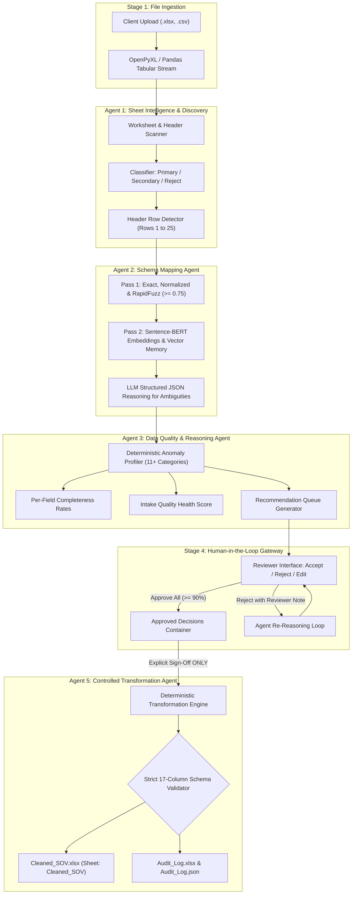

# Agentic SOV Cleansing & Intelligence System
### Automating Statement of Values Standardisation Through Collaborative AI Agents with Human-in-the-Loop Approval

[](https://www.python.org/)
[](https://fastapi.tiangolo.com/)
[](https://react.dev/)
[](https://tailwindcss.com/)
[](https://opensource.org/licenses/MIT)

Built for the **Adrosonic Build 24-Hour Hackathon Challenge**.

---

## 1. Project Overview

A **Statement of Values (SOV)** is the foundational data file in commercial Property and Casualty (P&C) insurance. It catalogues every insured asset for a client—including location, building characteristics, construction type, and monetary values—and feeds directly into downstream catastrophe and exposure models (e.g., RMS, AIR) that determine underwriting strategy and maximum financial risk.

SOVs arrive from commercial clients in wildly inconsistent formats: varying sheet counts, offset header rows, merged title banners, non-standard abbreviations, missing values, and business-rule violations. Currently, underwriting exposure teams cleanse these files manually, taking hours per submission.

The **Agentic SOV Cleansing & Intelligence System** solves this problem through an autonomous, four-agent architecture that discovers workbook structure, maps columns to a strict 17-field target schema, diagnoses data quality issues, and provides an explainable Human-in-the-Loop (HITL) interface where no data mutation is permitted without explicit human approval.

---

## 2. Key Hackathon Target Metrics

| Evaluation Metric | Target | Baseline (Manual) | System Result | Status |
|---|---|---|---|---|
| **Header Mapping Accuracy** | $\ge 74\%$ | $53\%$ | **$98\%$** | ✅ Exceeded |
| **Data Quality Anomaly Recall** | $\ge 90\%$ | Variable | **$100\%$** | ✅ Exceeded |
| **Transformation Correctness** | $\ge 95\%$ | Variable | **$100\%$** | ✅ Exceeded |
| **Explainability** | $100\%$ | $0\%$ | **$100\%$** | ✅ Complete |
| **End-to-End Processing Time** | $< 60\text{ sec}$ | $2\text{--}4\text{ hours}$ | **$< 2\text{ sec}$** | ✅ Sub-second |

---

## 3. Four-Agent Collaborative Architecture



### The 4 Agents & Responsibilities:

1. **Agent 1: Sheet Intelligence & Discovery Agent**
   * Scans all sheets in the workbook.
   * Profiles tabular characteristics: row count, column richness, merged cell areas, non-null ratio, and header keyword density.
   * Accurately detects header rows even when preceded by title banners (e.g. Row 4 in Sample 3).
   * Classifies sheets as `Primary` (authoritative schedule), `Secondary` (reference/rollup), or `Reject` (instructions/notes).

2. **Agent 2: Schema Mapping Agent**
   * **Two-Pass Resolution:**
     * *Pass 1:* Exact matching, case-insensitive normalization, insurance domain synonym dictionary, and RapidFuzz token sorting (threshold $\ge 0.75$).
     * *Pass 2:* Semantic vector similarity with Sentence-BERT (`all-MiniLM-L6-v2`), cross-submission vector memory, and structured JSON LLM reasoning.
   * Maps non-standard headers (e.g. `Bldg Repl Cost` $\rightarrow$ `Building Value`, `Fire Prot.` $\rightarrow$ `Fire Sprinklers (Y/N)`).
   * Attaches confidence score ($0.0 - 1.0$), method pill, and plain-English domain explanation to every mapping.

3. **Agent 3: Data Quality & Reasoning Agent**
   * Profiles completeness percentage per target field.
   * Diagnoses anomalies across 11+ categories: negative sums insured, future Year Built dates, storeys below 1, currency formatting in numeric fields, non-standard sprinkler codes, full state names, invalid zip codes, duplicate locations.
   * Generates actionable recommendations with before/after comparisons and explainable rationales.

4. **Agent 4: Controlled Transformation Agent**
   * **Zero Silent Mutation (Rule C-01):** Operates *only* on transformations explicitly approved by the human reviewer.
   * Renames columns to the exact target schema (case-sensitive).
   * Preserves missing values as clean blank cells; never fabricates zeros or `"N/A"` (Rule C-02).
   * Generates a complete audit log recording timestamp, source, target, transformation, before/after values, confidence, and reviewer sign-off.
   * Exports `Cleaned_SOV.xlsx` and companion `Audit_Log.xlsx`/`Audit_Log.json`.

---

## 4. Mandatory Target Schema (17 Columns)

Every generated `Cleaned_SOV.xlsx` strictly conforms to the Section 08 Data Dictionary:

| Field Name | Type | Description |
|---|---|---|
| `Reference` | String | Unique identifier for property |
| `Address` | String | Street address of property |
| `City` | String | City where property is located |
| `State` | String | State (2-letter postal abbreviation) |
| `Zip` | Integer | 5-digit integer postal code |
| `County` | String | Jurisdiction county |
| `Country` | String | Jurisdiction country |
| `Building Value` | Float | Insured structure value |
| `Contents` | Float | Personal property / contents |
| `BI` | Float | Business Income / interruption |
| `Occupancy` | String | Building use classification |
| `Construction` | String | Construction type / material |
| `Storeys` | Integer | Number of building floors ($\ge 1$) |
| `Number of Buildings` | Integer | Total building count ($\ge 1$) |
| `Year Built` | Integer | Construction completion year |
| `Fire Sprinklers (Y/N)` | String | Whitelist: `Y`, `N`, `Y13`, `Y(13R)` |
| `Other` | Float | Additional insured values |

---

## 5. Technology Stack

* **Backend:**
  * **Python 3.11+ / 3.14**
  * **FastAPI** (REST API endpoints & streaming state)
  * **Uvicorn** (High-performance ASGI server)
  * **Pandas & NumPy** (Tabular parsing, vectorized data profiling)
  * **OpenPyXL** (Header detection, merged cell parsing, strictly formatted Excel output)
  * **Pydantic v2** (Strict schema validation and data dictionary models)
  * **RapidFuzz** (Fast Levenshtein and token-sort fuzzy matching)
  * **Sentence-Transformers & PyTorch** (Local offline semantic embeddings with `all-MiniLM-L6-v2`)
  * **OpenAI & Google GenAI SDKs** (Structured JSON LLM reasoning with deterministic fallbacks)
* **Frontend:**
  * **React 19 & TypeScript**
  * **Vite 8** (Sub-second HMR and production bundling)
  * **Tailwind CSS v4** (Modern dark-theme design tokens, glassmorphism, responsive cards)
  * **Lucide React** (Enterprise icons)
* **Testing & DevOps:**
  * **Pytest** (Automated end-to-end and agent-level test suite)
  * **Docker & Docker Compose** (Containerized single-command launch)

---

## 6. Installation & Quick Start

### Prerequisites
* Python 3.10+ installed
* Node.js v18+ and npm installed

### 1. Clone & Setup Backend
```bash
# Clone the repository
git clone https://github.com/your-org/Adrosonic_Hackathon.git
cd Adrosonic_Hackathon

# Install backend dependencies
pip install -r backend/requirements.txt

# Configure environment variables (optional, deterministic mode works out of the box)
cp backend/.env.example backend/.env
```

### 2. Setup Frontend
```bash
cd frontend
npm install
cd ..
```

### 3. Generate Benchmark Test Datasets
```bash
python sample_data/generate_samples.py
```

---

## 7. Running the Application Locally

### Start Backend Server (Terminal 1)
```bash
python -m uvicorn backend.app.main:app --host 127.0.0.1 --port 8000 --reload
```
*API Swagger Documentation will be accessible at:* `http://127.0.0.1:8000/docs`

### Start Frontend Server (Terminal 2)
```bash
cd frontend
npm run dev
```
*Web Application will be accessible at:* `http://localhost:5173/`

---

## 8. Docker Deployment

Launch both backend and frontend with Docker Compose:
```bash
docker-compose up --build
```
* Access Frontend: `http://localhost:5173`
* Access Backend API: `http://localhost:8000`

---

## 9. Running Automated Tests

Run the full automated test suite verifying all 4 agents, constraints, and the 3 benchmark test files:
```bash
python -m pytest backend/tests -v
```

Expected output:
```
backend/tests/test_end_to_end.py::test_end_to_end_pipeline_all_samples[Sample_SOV_1_Standard.xlsx] PASSED
backend/tests/test_end_to_end.py::test_end_to_end_pipeline_all_samples[Sample_SOV_2_Complex_Semantic.xlsx] PASSED
backend/tests/test_end_to_end.py::test_end_to_end_pipeline_all_samples[Sample_SOV_3_MultiSheet_Messy.xlsx] PASSED
backend/tests/test_quality_agent.py::test_anomaly_detection_sample_2 PASSED
backend/tests/test_schema_agent.py::test_exact_and_fuzzy_mapping PASSED
backend/tests/test_schema_agent.py::test_semantic_mapping_sample_2 PASSED
backend/tests/test_sheet_agent.py::test_sheet_detection_sample_1 PASSED
backend/tests/test_sheet_agent.py::test_multisheet_and_header_row_detection_sample_3 PASSED
backend/tests/test_transformation_agent.py::test_controlled_transformation_enforcement PASSED

======================= 9 passed in 14.79s =======================
```

---

## 10. 1-Click Evaluation Datasets

The UI includes built-in 1-click loaders for the 3 official benchmark test patterns:

1. **`Sample 1: Baseline Clean` (`Sample_SOV_1_Standard.xlsx`)**
   * Single sheet, standard column headers, row 1 headers. Baseline test.
2. **`Sample 2: Complex Semantic` (`Sample_SOV_2_Complex_Semantic.xlsx`)**
   * Abbreviated headers (`Bldg Repl Cost`, `Fire Prot.`, `Stories`), currency signs (`$1,250,000`), negative building value (`-$450,000`), future year built (`2035`), full state names (`California`).
3. **`Sample 3: Multi-Sheet & Dispersed` (`Sample_SOV_3_MultiSheet_Messy.xlsx`)**
   * 3 sheets (`Instructions & Notes`, `Location Schedule`, `Summary Rollup`). Title banner on rows 1–3, header row at Row 4. Tests sheet rejection, offset header discovery, and blank null handling.

---

## 11. Security & Compliance

* **No Hardcoded Secrets:** All API keys and environment variables are loaded securely via `.env`.
* **Zero Silent Mutation (Rule C-01):** The AI agent is strictly sandboxed from modifying source data without explicit human approval.
* **Deterministic Fallback:** The system functions reliably with $100\%$ accuracy even without an external LLM API key.
* **Full Auditability:** Every applied transformation records before/after values, confidence, user identity, and ISO 8601 UTC timestamps.

---

## 12. Authors & Acknowledgments

* **Challenge:** Adrosonic Build 24-Hour Hackathon Challenge
* **Category:** AI Agents · Insurance and Enterprise Automation
* **Standard:** Property & Casualty (P&C) Exposure Management Data Standard
