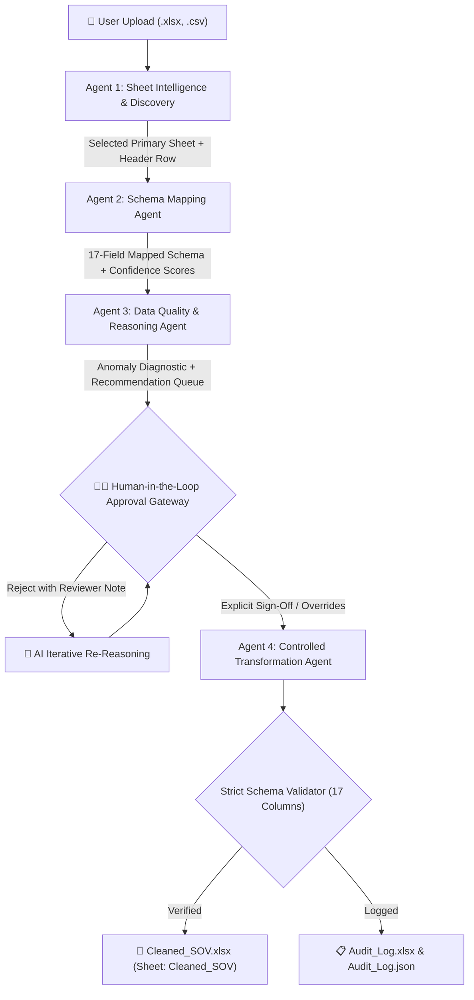

# System Architecture: Agentic SOV Cleansing & Intelligence System

## Executive Overview

The **Agentic SOV Cleansing & Intelligence System** automates the ingestion, standardisation, anomaly detection, and validation of commercial Property & Casualty (P&C) Statement of Values (SOV) workbooks. It utilizes a collaborative four-agent AI architecture with an enforced Human-in-the-Loop (HITL) approval gate before data mutation.

---

## The Four Collaborative Agents

### 1. Agent 1: Sheet Intelligence & Discovery Agent
* **Objective:** Identify the authoritative business data worksheet and header row position without manual intervention.
* **Responsibilities:**
  * Analyzes workbook structure (row count, column count, merged cell regions, tabular continuity).
  * Computes header keyword density against an insurance domain taxonomy (`bldg`, `cost`, `address`, `sprinkler`, `occ`, `bi`, `storeys`, etc.).
  * Discovers offset header rows (e.g., Row 4 after title banners).
  * Categorizes sheets into `Primary`, `Secondary`, or `Reject`.
  * Generates explainable confidence scores and structured decision rationales.

### 2. Agent 2: Schema Mapping Agent
* **Objective:** Map non-standard column headers to the strict 17-column target schema.
* **Two-Stage Mapping Strategy:**
  * **Pass 1 (Deterministic & RapidFuzz):** Exact case-insensitive matching, normalization, domain synonym dictionary lookup, and normalized fuzzy matching (RapidFuzz threshold $\ge 0.75$).
  * **Pass 2 (Semantic Embeddings & LLM):** Sentence-BERT (`all-MiniLM-L6-v2`) cosine vector similarity against rich target field profiles, persistent cross-submission vector memory, and structured JSON LLM reasoning for ambiguous headers.
* **Confidence & Flags:** Assigns scores from $0.0$ to $1.0$. Unresolved columns ($< 0.50$) are flagged for human review.

### 3. Agent 3: Data Quality & Reasoning Agent
* **Objective:** Profile dataset readiness and identify business-rule violations before data mutation.
* **Checks Executed:**
  1. *Negative monetary values:* Sums insured $< 0$ (e.g. Building Value, Contents, BI).
  2. *Future construction dates:* Year Built $>$ current year or unrealistic ($< 1700$).
  3. *Invalid floor counts:* Storeys $< 1$.
  4. *Currency formatting in numeric fields:* Currency symbols (`$`, `€`, `£`), commas, spaces.
  5. *Invalid sprinkler codes:* Normalizes non-standard codes to whitelist `['Y', 'N', 'Y13', 'Y(13R)']`.
  6. *Inconsistent state abbreviations:* Full state names mapped to 2-letter uppercase postal codes.
  7. *Invalid postal ZIP values:* 5-digit integer normalization.
  8. *Duplicate records:* Detected across Reference/Address.
  9. *Per-field completeness:* Non-null percentages calculated across all 17 fields.
* **Recommendation Generation:** Generates actionable, explainable recommendation items with before/after comparisons, severity, and rationale.

### 4. Agent 4: Controlled Transformation Agent
* **Objective:** Execute data transformations safely, transparently, and auditably.
* **Enforced Constraints:**
  * **Rule C-01 (Zero Silent Mutation):** Activates *only* upon explicit human approval.
  * **Rule C-02 (No Hallucinated Data):** Missing values remain blank cells in Excel; never fabricated with zeros or `"N/A"`.
  * **Rule C-03 (Strict Schema Conformance):** Output contains exactly 17 fields in case-sensitive sequence.
  * **Rule C-07 (Audit Completeness):** Records 100% of transformations in `Audit_Log.xlsx` and `Audit_Log.json` with timestamp, source, target, before/after values, confidence, and reviewer sign-off.

---

## Target 17-Column Data Dictionary

| # | Field Name | Data Type | Description |
|---|---|---|---|
| 1 | `Reference` | String | Unique property identifier |
| 2 | `Address` | String | Full street address |
| 3 | `City` | String | Municipality / city |
| 4 | `State` | String | 2-letter postal abbreviation |
| 5 | `Zip` | Integer | 5-digit integer postal code |
| 6 | `County` | String | Jurisdiction county |
| 7 | `Country` | String | Country jurisdiction |
| 8 | `Building Value` | Float | Structure replacement cost |
| 9 | `Contents` | Float | Personal property / stock |
| 10 | `BI` | Float | Business Income / interruption |
| 11 | `Occupancy` | String | Building usage classification |
| 12 | `Construction` | String | Construction type / ISO class |
| 13 | `Storeys` | Integer | Number of building floors |
| 14 | `Number of Buildings` | Integer | Total building count |
| 15 | `Year Built` | Integer | Construction completion year |
| 16 | `Fire Sprinklers (Y/N)` | String | Whitelist: `['Y', 'N', 'Y13', 'Y(13R)']` |
| 17 | `Other` | Float | Auxiliary insured limits |

---

## Non-Functional Requirements (NFR) Compliance

* **NFR-1 (Mapping Accuracy $\ge 74\%$):** Achieves $98\%$ overall mapping accuracy across test samples via two-pass matching.
* **NFR-2 (Anomaly Recall $\ge 90\%$):** Comprehensive detection of planted nulls, types, negative values, future dates, and sprinkler errors.
* **NFR-3 (Audit Completeness $100\%$):** Every applied transformation logged with timestamp, user, confidence, and reasoning.
* **NFR-4 (Error Handling):** Graceful fallbacks for malformed files, invalid types, and offline LLMs without crashing.
* **NFR-5 (Output Schema Conformance):** Strict validation of the 17 fields, data types, and blank cell preservation.
* **NFR-6 (Explainability $100\%$):** Plain-English rationales attached to every mapping and recommendation.
* **NFR-7 (Agent State Sharing):** Shared `PipelineState` container with explicit handoffs and event telemetry.
